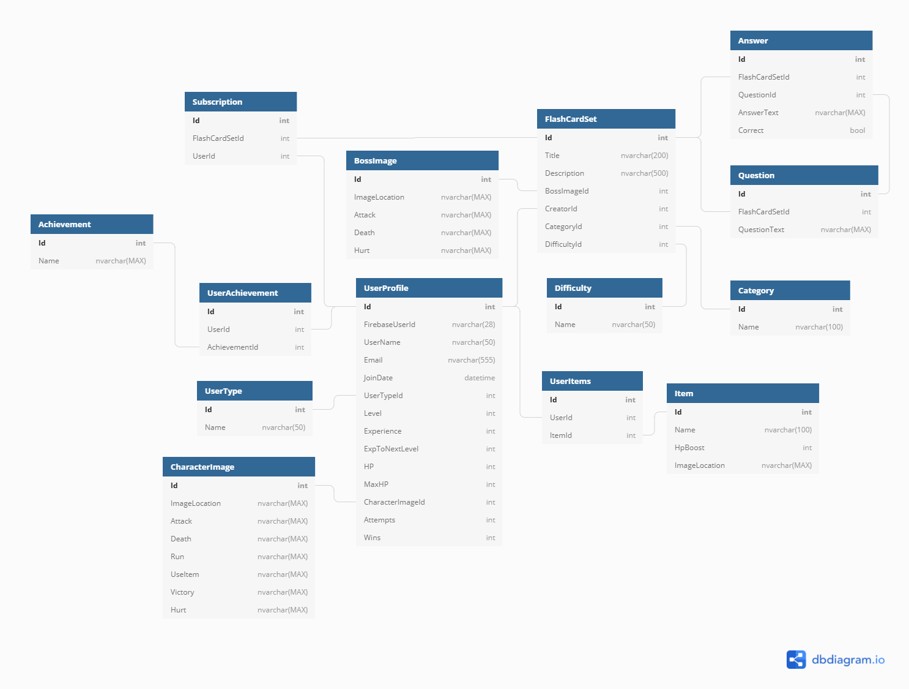

# Study Hero

Study Hero is a community-driven learning app that was created to help users study and master any topic by using both the study mode (flashcards) and battle mode (test). Users can create, edit, view, and share their flashcard sets with other users so studying various topics becomes more and more accessible each day. To add a bit of extra motivation the app has gamified elements wrapped around it to make learning more fun! Here’s a breakdown of the process:

### Study Mode
* This is your standard flashcard study session to help with retention of information
* Users can go through the cards and show/hide the answer
* The user selects whether they got it right or wrong. This is honor system based because the battle mode will catch any true gaps in knowledge
* The user gains a small amount of character experience per card studied
* The user has a chance to get 1 of 3 health restoring items at the end of each session. There is a possibility to find nothing as well

### Battle Mode
* This is where users test their knowledge in a multiple choice test format against the “boss”
* Each correct answer does damage to the “boss”
* Each incorrect answer does damage to the player
	* If the users health hits 0 then the test ends
	* Users cannot battle any more until they heal their character
	* Healing items can be obtained in study mode
* Users must get 100% right on the test in order to defeat the boss

### Creators (anyone can create them!)
* User creates a study and battle set at the same time
* User sets the title, description, difficulty level, and category for this set
* Each question added must have 1 correct answer and 3 incorrect answers
* User can add as many questions as they want to sets they created
* User can edit and delete entire flashcard sets they created
* User can edit, delete, or add question/answers to flashcard sets they created

### General Users
* Can view all created flashcard sets from the ‘Browse’ tab on the navbar, and then sort them by difficulty and/or category
* Can study or battle any flashcard set on the site
* Can subscribe to sets that other users have created and easily view them in their subscriptions tab from the navbar
* Can view sets they have created from the ‘My Sets’ tab on the navbar

### Admin Users
* Can do anything a regular user can do
* Can edit or delete ANY flashcard set created even if they are not the creator
* Can deactivate users which will no longer allow them to login or reactivate them to restore access
* Can promote users to admin or demote admin to users as long as one admin remains

## See It In Action

GIFs coming soon!

## Technologies Used

### Front-end
* React
* React-strap
* Firebase Authentication
* Custom CSS
* NES CSS library

### Back-end
* .NET 5
* ASP.NET Core
* MS SQL Server

## Design and Development
* Miro - Wireframing

* DbDiagram.io - Entity Relationship Diagram

### Running The App

## Requirements
* Git
* Visual Studio (configured to run server-side ASP.NET Web API C# code)
* MS SQL Server (Express or higher)
* NodeJS

## Firebase

You will need to create a Firebase project to have working authentication and authorization.

* Go to Firebase and create a project (can be named anything). Add authentication in the form of email/password to the project.
* In the project settings, you will need your `Project Id` and `Web API Key`

## Clone the project
From a terminal window, in any directory you'd like, run: git clone `git@github.com:rryb77/FlashcardFight.git`

## Back-end setup
* In `FlashcardFight/appsettings.json` change the `FirebaseProjectId` value to your Firebase `Project Id`
* From `FlashcardFight/SQL`, run the scripts `01_Db_Create.sql` and then `02_Seed_Data` to generate the database
* To use the default test account `test@example.com`, create a user account in your Firebase project's auth section with that email address (and any password) and replace the data in that user's `FirebaseUserId` column in the database with the id generated in your Firebase project
* Load `FlashcardFight.sln` in Visual Studio and hit F5 to run the server (after ensuring that FlashcardFight is selected instead of the default IIS Express server)

## Front-end Setup
* Create a file in `FlashcardFight/client/` called `.env.local`
* In this file, paste `REACT_APP_API_KEY=Web API Key`, replacing "Web API Key" with your unique key from your Firebase project's project settings
* Run `npm install` in `FlashcardFight/client` to install all dependencies
* To start the development server on `localhost:3000`, run `npm start`
* A browser window should open with the authentication page and you can enter `test@example.com` as your email address with the password you added in Firebase
